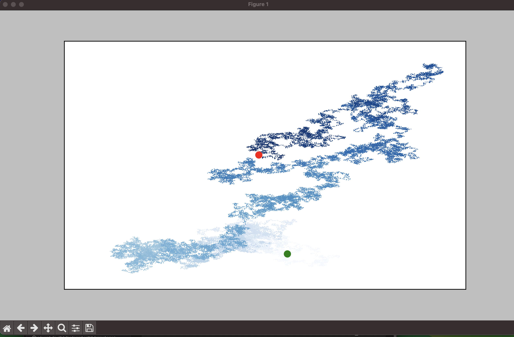
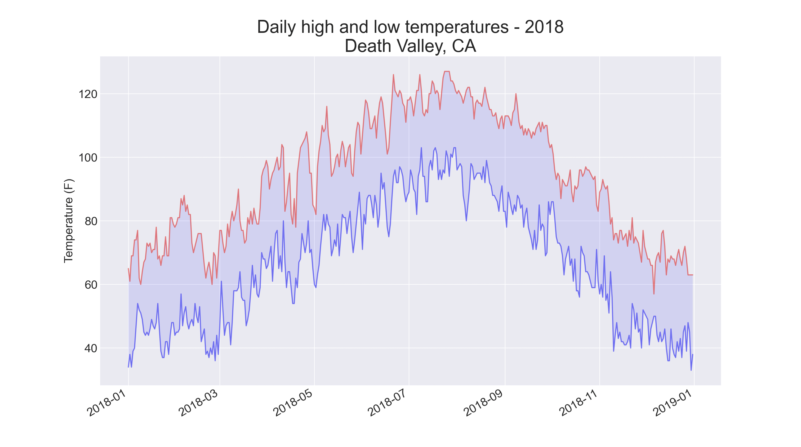
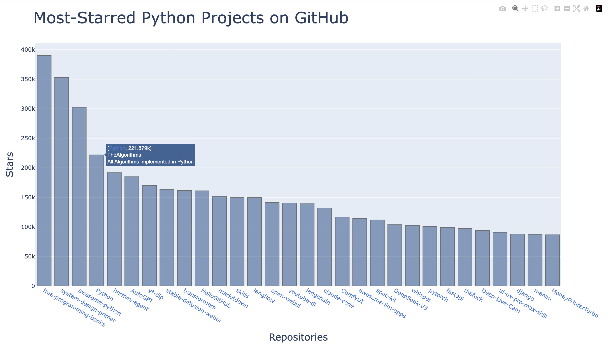

# Visual Projects

Data visualization and API projects from *Python Crash Course* by Eric Matthes.

## Projects

### Beginner Projects
- **Matplotlib Squares** — plotting squares with scatter plots
- **Random Walk** — simulating and visualizing random movement
- **Dice Rolls** — simulating dice rolls and visualizing distributions

### Data Analysis
- **Sitka Weather** — charting temperature highs and lows from real CSV data
- **Death Valley Weather** — analyzing temperature data from Death Valley
- **Earthquake Data** — exploring and mapping global earthquake data

### Working with APIs
- **GitHub Repos** — fetching and visualizing top Python repositories from GitHub API
- **Hacker News** — visualizing most-commented articles from Hacker News API

### Visualizations 





## Tech Stack

- Python 3
- Matplotlib
- Plotly
- Requests

## Setup

```bash
pip install matplotlib plotly requests
# Then run any script, e.g.:
python beginner_projects/rw_visual.py
```

## What I Learned

- How to build charts with Matplotlib: line plots, scatter plots, bar charts
- Interactive visualizations with Plotly
- Working with real-world CSV data and handling missing values
- Fetching and parsing JSON from public APIs

---

*Other projects: [alien_invasion](https://github.com/useinov09/alien_invasion) · [learning_log](https://github.com/useinov09/learning_log)*
